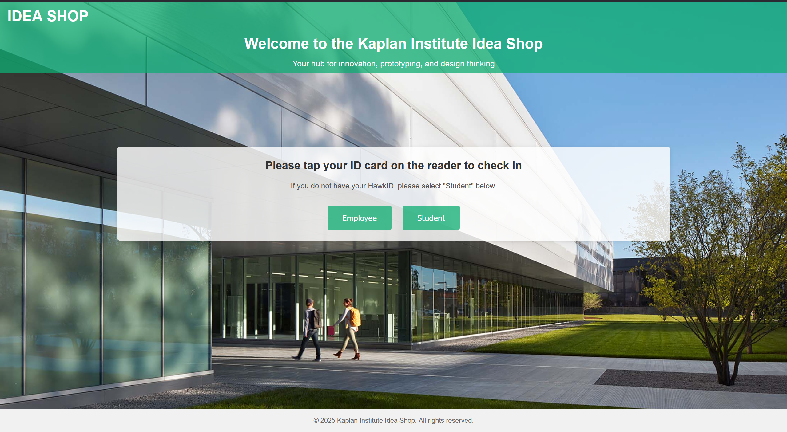
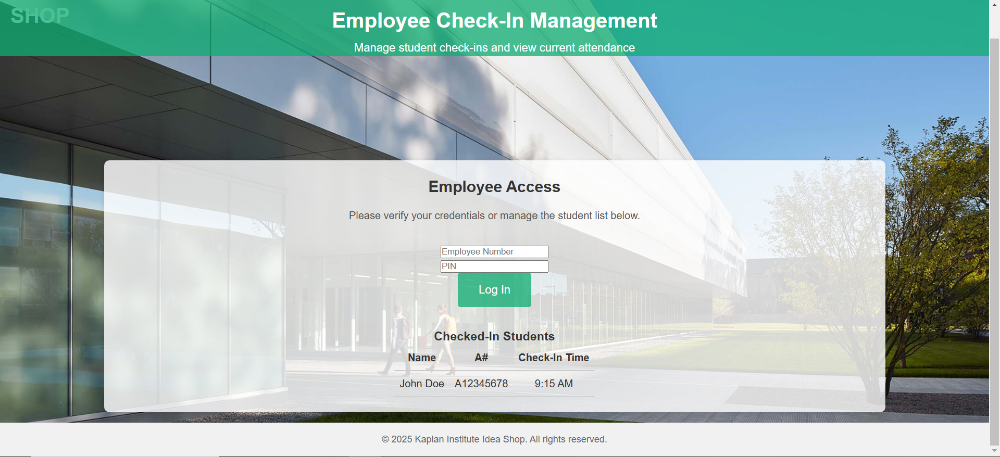
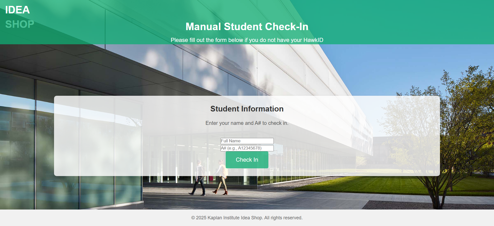
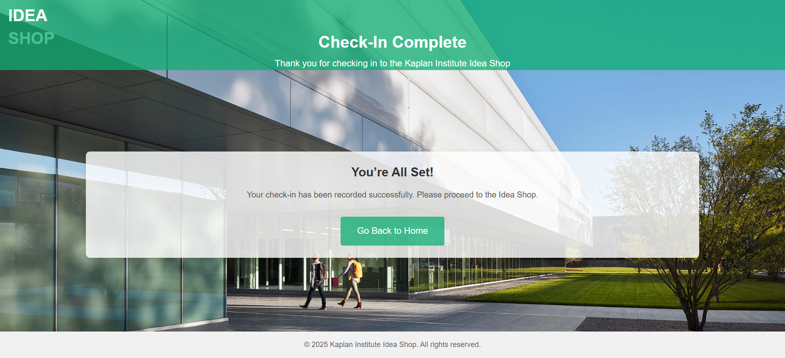
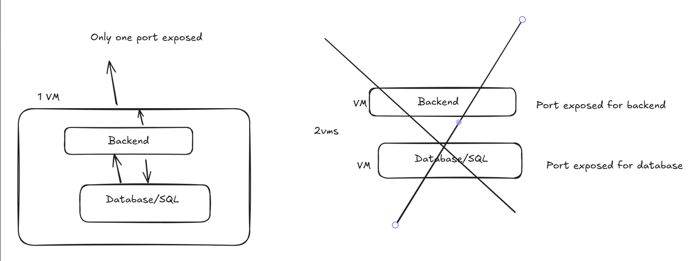

# Sprint-02 Report

## Introduction

Previously on Sprint-01, the project was at a conceptual phase. We had a flowchart of that outlined how the application would function from the perspective of the student user. We also had some conceptual UI for the site where the student would be interacting with.

Now in Sprint-02, the team has deployed the site where a student user will log in using their credentials. In Sprint-02, we reassigned our roles as follows:

Project Manager: Kevin Alexis Aguilar

Developers: Evelyn & Yawar

UI/UX Design: Jack

IT Operations: Tomari

## Tasks

**Project Manager**
* Assign tasks
* Publish end of the week report discord
  * State what tasks are finished
  * Document the changes between Sprint-01 and Sprint-02
* Develop Sprint-02 report

**Developers**
* Create schema in Airtable
  * Create 5 simulated student records
  * Strive for 3NF for tables when beneficial
* One developer connect Airtable to Python
* The other developer should transition the database from Airtable to SQL

**UI/UX**
* Develop the site pages
  * homepage
  * student login
  * employee login
  * check in complete
* Integrate normalize css file (This gives you a true blank canvas to make the styling process easier)
* Separate folders for CSS, HTML, and other assets (images).

**IT Orchestration and Security**
* Set up the server virtual machine
  * If needed, refer to tutorial videos on the Sprint-02 section on Canvas
* Identify what secrets we have.
  * E.g. API keys
* Connect back-end to database

## Site

**Home Page**

The team decided to eliminate the admin login option, so now there's only employee and student logins. A student can log in by simply scanning their hawk ID. If they don't have it at their disposal, they can press the student login button to manually put in their information.

**Employee Login Manual**

When an employee wants to log in, they will insert their number and a PIN. Alongside, they can see the students who have logged in earlier.

Maybe we shouldn't have the student logins displayed at the employee login, it is massive breach of privacy since any person can press on the employee button and see this data without needing to authenticate. We should also add some styling to the input fields.

**Student Login Manual**

If a student doesn't have a hawk ID on them, they can still log in by inserting their full name and hawk ID.

We should add styling and spacing to the input fields to replace the default look.

**Check-in Complete**

This screen pops up when the login was successful.

We could possibly add a timer to this screen where if no one presses the go back home button, the page would go back automatically.

## Database

In this current iteration, Airtable was implemented to hold our data.

Database Name: ideashop_tapin

Table 1: students

This is where it keeps record of all students

| student_id  | name | email | created_at |
| ------------- | ------------- | ------------- | ------------- |
| H001  | Alice Johnson | alice@example.com | 2025-02-28 13:34:16 |
| H002  | Bob Smith | bob@example.com | 2025-02-28 13:34:16 |
| H003  | Charlie Brown | charlie@example.com | 2025-02-28 13:34:16 |
| H004  | David Lee | david@example.com | 2025-02-28 13:34:16 |
| H005  | Emily Davis | emily@example.com | 2025-02-28 13:34:16 |
| H006  | Frank Harris | frank@example.com | 2025-02-28 13:34:16 |

Table 2: tap_in_logs

This is where it keeps record of the times when a student attempted to log into the site.

| log_id  | student_id | tap_in_time |
| ------------- | ------------- | ------------- |
| 1  | H001  | alice@example.com | 2025-02-28 13:35:03 |
| 2  | H002  | bob@example.com | 2025-02-28 13:40:10 |
| 3  | H003  | alice@example.com | 2025-02-28 13:45:20 |
| 4  | H004  | bob@example.com | 2025-02-28 13:50:30 |
| 5  | H005  | alice@example.com | 2025-02-28 13:52:10 |

## VMs

There is a single VM that hosts both the database and the backend API. Our Operations and Security individual explained that the database setup is a bunch of SQL scripts while the API is a fastAPI endpoint so a user could technically communicate with the database locally from the VM and expose only the fastapi port without needing a vm to host the database and another for the backend. There would be no need to expose a port for SQL since it will be in the same VM as the backend. However, we recieved feedback that we should have this seperate. This current design would also prevent encryption, replication and scaling all at the same time.

## Conclusion

Overall, this sprint brought functionality in our project with having a front-end (the UI) and back-end (python) and database deployed. What's next for sprint-03 is to refine with what we have. This includes improving the UI of the website, fix the privacy issue of student log ins being publically accessible, reworking the VM setup, and migrating the database from airtable to SQL. 