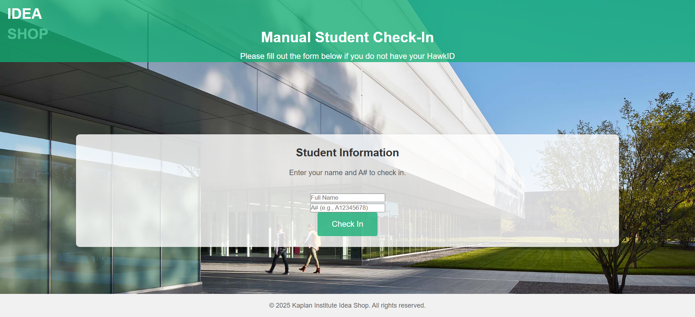

# Spring 2025 - Team 05

## The IdeaShop Tap-In System:
Our goal with this project is to create a Tap in system for the Ideashop in Kaplan. Students will tap their IDs, this will query a database to check for their safety trainings and validate entry to the shop. Our scope will aim to provide a proof of concept that will hopefully be integrated with the IIT API for ID systems in the future. 

## **_Sprint 3 - Due March 31st_**

## Roles for this Sprint:

- PM - Evelyn Myers
- IT OP - Jack Jarjourah
- UI/UX - Kevin Aguilar
- Developers - Tomiwa Ibrahim & Yawar Kamran

## **_Review of last Sprint_**
**- Login Site:**

- Last Sprint, we finalized the look of our sign-in pages for the Idea Lab.

- We implemented options for each type of user.
- The first page above is for students with their IDs.
- Don't worry, we have one for students without, too. We've all been there.
- These are the other pages:

- This is the manual sign-in for employees

- This is the manual sign-in for students

- This is the completion page for all users

**- Database:**

- We also have started using an Airtable to store data, which we connected to a VM later on that hosts both the database and backend. 

## _Sprint 03_

- For this Sprint, we focused mainly on getting the our card reader set up to a Raspberry Pi and getting credentials set up for the ProxMox to deploy our VM.
- Finishing this set up would almost complete our project. All we need after is to test the connections with the card reader, which we will start this week, then get everything connected in the lab (cue the kermit gif!)

  
*Overview of session handling between frontend, backend, and Raspberry Pi devices*

### Dev Environment

- **Devcontainers** are configured for the database, frontend, and backend services.
- **Private Docker network** ensures secure communication between containers.

### Authorization Flow

1. **JWT Generation**
   - After login, the backend generates a session entry in the database and signs a JWT containing the session ID.
   - Tokens are immutable and secure—ideal for logins on devices like shared Raspberry Pis.

2. **Frontend Handling**
   - JWT tokens are stored in cookies with:
     - `SameSite: strict`
     - `httpOnly: true`
     - `secure: true`

3. **Backend Middleware**
   - Middleware checks JWT validity and attaches session metadata to incoming requests.

4. **Session Revocation**
   - Session IDs (rather than long-lasting JWTs) allow for revoking access on any device, at any time, without waiting for expiration.

---
